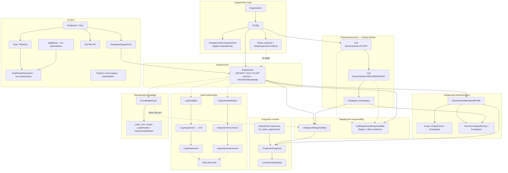
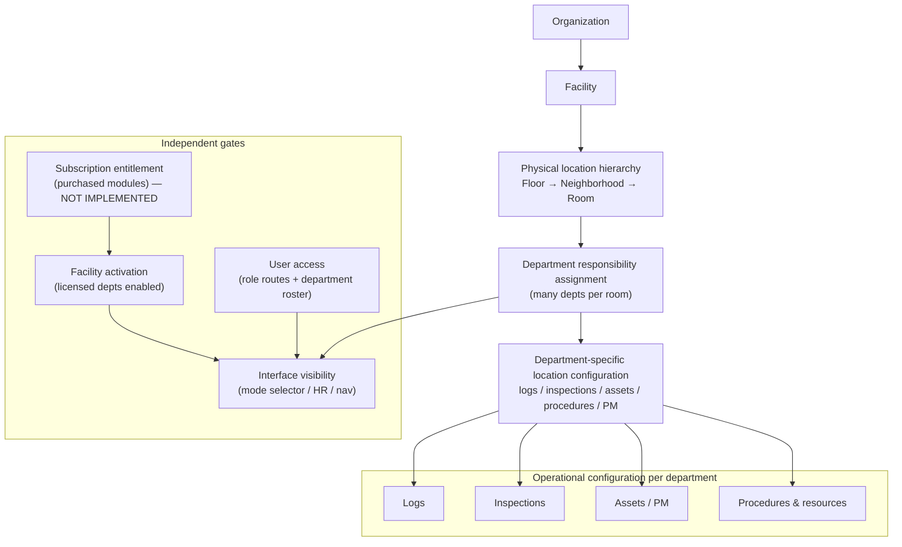

# Administration Information Architecture Audit

**Mode:** PLAN / AUDIT ONLY (no product code, migrations, or UI redesign)  
**Date:** 2026-07-20  
**Scope:** `ltc-manager/` — schema, services, routes, adapters, feature flags, and architecture docs  
**Companion target IA (aspirational):** `docs/department-administration/07_ADMIN_INFORMATION_ARCHITECTURE.md`

---

**Implementation status (2026-07-20):** Presentation / navigation Option A shipped in `docs/administration/02_ADMINISTRATION_IA_NAVIGATION_IMPLEMENTATION.md`. Domain behavior, Projection, and entitlements are unchanged.

---

## 1. Executive summary

The Administration experience feels fragmented because **several distinct problems coexist**, not because one domain is missing.

| Problem class | Severity | Evidence |
|---------------|----------|----------|
| **Information architecture** | High | `/admin` is a flat list of unrelated capabilities; top-nav “Administration” is a wider zone (`/employees`, `/logs`, `/menus`, `/assets`, `/repairs`, `/admin`) that is not the same as the platform hub |
| **Terminology** | High | Landing says “General Managers only” but code gates **Facility Administrator**; Permissions UI says “Jobs” but means `Role`, not `JobTitle`; Facility Builder landing says “sections/units” while vocabulary is Floor / Neighborhood / Room |
| **Navigation consistency** | Medium | Crumb root is “Admin” vs “Administration”; Knowledge uses a unique “Admin home” button; no shared “Back to Administration” pattern |
| **Domain ownership (mostly sound)** | Low–Medium | Facility Builder vs Department Administration boundaries are already documented and largely implemented; confusion is presentation, not absence of ownership |
| **Data-model limitations** | Medium | Department soft-activation collapsed into `showInEmployeeApp`; no subscription entitlement for modules; operator is a single facility string; `UnitDepartmentResponsibility` still exists beside room-level `UnitSpaceResponsibility` |
| **Duplicate implementation** | Medium (logs/inspections) | Logs and inspections are **correctly separate domains** with overlapping field UX; Experience `FORMS`/`CHECKLISTS` tool keys lack models and are the real duplication risk |

**Primary diagnosis:** information architecture + terminology + navigation consistency, layered on a few real data-model gaps (entitlements, operator scope, activation flags). Domain ownership for physical hierarchy and department operational profiles is **already clearer in code and constitution docs than the Admin hub suggests**.

**What is not broken:** room ↔ multi-department assignment (`UnitSpaceResponsibility`); shared Locations + Sidebar projection (`LocationsViewModel`); Logs ≠ Inspections as engines; Operational Knowledge as enrichment (not ownership).

---

## 2. Current Admin route inventory

**Shell:** All `/admin/*` pages use `AppShell` via `(protected)/layout.tsx`. Admin gate: `AdminLayout` → `assertFacilityAdministratorPage()` (`src/app/(protected)/admin/layout.tsx`, `src/lib/facility-admin-guard.ts`).

**Important:** Top-nav **Administration** (`src/lib/administration-nav.ts`) is a **menu zone**, not a synonym for `/admin`. Only `/admin` sits under “Platform administration.” Child `/admin/*` routes are hub cards, not separate dropdown items.

| Current label | Route | Underlying component | API / service dependencies | Primary models | Access control | Actual responsibility | Navigation consistency | Recommended disposition |
|---------------|-------|----------------------|----------------------------|----------------|----------------|------------------------|------------------------|-------------------------|
| Admin (hub) | `/admin` | `AdminPage` | None (static links) | — | FA via `AdminLayout`; proxy `WAVE1_ROUTE_MIN_ROLES["/admin"]` | Link index for platform config | N/A | **Keep** — rename H1 to Administration; fix GM→FA copy |
| Facility Builder | `/admin/facility/builder` | `FacilityBuilderPage` → `FacilityBuilderClient`, `FacilityTerminologySettings` | `loadFacilityHierarchy`, builder `actions.ts` | `Unit`, `UnitSpace`, `UnitSpaceResponsibility`, `UnitDepartmentResponsibility`, `Facility` vocabulary | FA layout; page/actions often MANAGER+ (redundant) | Physical hierarchy + room/unit department responsibility + capabilities + vocabulary | Crumb: **Administration** → Builder | **Keep** — align landing vocabulary; standardize crumb |
| Departments | `/admin/departments` | `AdminDepartmentsPage`, `DepartmentVisibilityForm` | `ensureDefaultDepartments`, `setDepartmentShowInEmployeeAppAction`, `setDepartmentHeadAction` | `Department`, `Employee` | FA | Toggle `showInEmployeeApp`, assign heads, deep-link to Dept Admin | Crumb: **Admin** | **Keep** — clarify copy (HR visibility ≠ licensing) |
| Department Administration | `/admin/departments/[departmentId]` | `DepartmentAdministrationPage` + tab panels | `loadDepartmentAdminView`, profile actions | `DepartmentOperationalProfile`, areas, archetypes, bindings, exceptions | FA + `DEPARTMENT_OPERATIONAL_PROFILES_ENABLED`; writes Manager+ | Operational model authoring (Areas, Experiences, archetypes, profile lifecycle) | Crumb Admin / Departments / name; local tabs | **Keep** (nested) — do not promote to top-level hub card |
| Permissions | `/admin/permissions` | `AdminPermissionsPage` → `AccessMatrix` | None — read only | `src/lib/route-registry/platform-routes.ts` (no database read) | FA only, via `assertFacilityAdministratorPage` | Read-only Access Matrix of platform role × product area | Crumb: Admin | **Done** — route policy is platform-owned (see `ADR_PLATFORM_OWNED_ROUTE_AUTHORIZATION_2026-08-04.md`) |
| Inspections | `/admin/inspections` | `AdminInspectionsPage` → `InspectionDefinitionEditor` | `upsertInspectionDefinitionAction`, inspection lib | `InspectionDefinition`, items, submissions, occurrences | FA page; MANAGER+ actions | Author inspection definitions; list submissions | Crumb: Admin | **Keep** — consider regroup under Operational configuration |
| Operational knowledge | `/admin/knowledge` | `AdminKnowledgePage` | knowledge actions, contextual loaders | `KnowledgeArticle` + link tables | FA page; MANAGER+ actions | SOP/reference library + object links | Unique “Admin home” button | **Rename** presentation (e. for Procedures & resources); **Keep** domain |
| Organization | `/admin/organization` | `AdminOrganizationPage` | org/facility actions, handbook, device bind | `Organization`, `Facility` | FA | Org entity + facility settings + legacy operator label + handbook + PIN device | Crumb: Admin | **Keep** / **Regroup** under Facility & Organization |
| Organization facilities | `/admin/organization/facilities` | `OrganizationFacilitiesPage` → `FacilityAccessManager` | `loadOrganizationFacilitySummaries`, grant/revoke | `UserFacilityAccess`, `Facility` | FA + user authKind + `canManageFacilityAccess` | Multi-site summary + explicit facility access grants | 3-level crumb | **Keep** nested; optional **Move** off hub (reach via Organization only) |

### Adjacent (not `/admin` children, but Administration-zone)

| Label | Route | Disposition note |
|-------|-------|------------------|
| Employees | `/employees` | Administration menu “People” — not platform hub |
| Logs | `/logs` | Administration menu “Operational setup” — log **builder** lives here, not under `/admin` |
| Menus | `/menus` | Dietary-scoped |
| Assets / Repairs | `/assets`, `/repairs` | Plant-leaning; Administration “Facilities” section |
| `/settings` | redirect | Proxy → `/admin/organization` — legacy alias **Keep** |
| `/department/settings/[departmentId]` | parallel head UI | **Requires product decision** / likely **Deprecate** into `/admin/departments` |

---

## 3. Current domain model diagram



---

## 4. Intended domain model diagram



**Principle to preserve:** physical hierarchy is shared; responsibility is multi-department; configuration and work instruments are department-specific; knowledge enriches but never establishes responsibility.

---

## 5. Location visibility trace

Sample path: **Servery room** under **Dietary** mode.

```text
1. DATABASE
   Facility
   → Unit (FLOOR)
   → Unit (NEIGHBORHOOD)
   → UnitSpace (Servery; unitId set; isActive)
   → UnitSpaceResponsibility(spaceId, dietaryDepartmentId, capabilities[])

2. FACILITY BUILDER
   loadFacilityHierarchy → SpaceView with responsibilities
   Authoring: upsertBuilderSpaceResponsibilityAction
   Files: src/lib/facility-builder/load-facility-hierarchy.ts
          src/app/(protected)/admin/facility/builder/actions.ts

3. PROJECTION SOURCE
   loadProjectionSource
   - builds locations from Units + UnitSpaces
   - assignedDepartmentIds from UnitSpaceResponsibility only
   - assignedRoomIds per department from those IDs
   - loads ACTIVE DepartmentOperationalProfile (if any)
   - Plant policy attached when PLANT isActive
   File: src/lib/projection/load-source.ts

4. PROJECTION PIPELINE
   resolveProjectionLens (DEPARTMENT Dietary)
   resolveRoomEligibility:
     placed + active + not staged
     AND explicitAssignment for Dietary
     AND ACTIVE profile + resolvable archetype Experiences
     AND principal access class
   buildAndPruneProjectionLocations → STRUCTURAL vs ACTIONABLE
   File: src/lib/projection/pipeline.ts

5. LOCATIONS VIEW MODEL
   adaptProjectionToLocationsView → LocationsViewModel / LocationsTreeNode
   enrichLocationsRoomDisplay (room numbers only)
   Files: src/lib/locations/adapt-projection.ts
          src/lib/locations/enrich-room-display.ts
          src/lib/locations/types.ts

6. LOCATIONS PAGE (/units)
   Flag PROJECTION_LOCATIONS_ENABLED (default true)
   loadLocationsView → LocationsHierarchyBrowser
   Files: src/lib/locations/load-locations.ts
          src/components/locations-hierarchy-browser.tsx
          src/app/(protected)/units/page.tsx

7. LEFT SIDEBAR
   Flag PROJECTION_SIDEBAR_ENABLED (default true)
   Same LocationsViewModel → adaptLocationsViewToSidebar → LeftSidebar
   Files: src/lib/locations/load-sidebar.ts
          src/lib/locations/adapt-sidebar.ts
          src/components/left-sidebar.tsx
          src/components/app-shell.tsx

8. DEPARTMENT MODE
   Cookie ltc_active_department → resolveActiveDepartmentForShell
   → lens DEPARTMENT with Dietary key
   File: src/lib/active-department-context.ts

9. ROUTE DESTINATION
   Room ACTIONABLE href: /unit/[unitId]?space=[spaceId]
   Floor/Neighborhood ACTIONABLE: /unit/[unitId]
   STRUCTURAL: href null
```

### Filters / adapters involved (ordered)

| Step | Filter / adapter | Re-applies department filter? |
|------|------------------|-------------------------------|
| Facility Builder visibility | `operationalUnitWhere`, staged/undesignated exclusion | N/A (authoring) |
| Source load | responsibilities → `assignedDepartmentIds` | Yes (assignment) |
| Pipeline eligibility | assignment / Plant policy + profile + prune | Yes |
| `adaptProjectionToLocationsView` | Hierarchy + experiences only | **No** |
| `adaptLocationsViewToSidebar` | Presentation remap | **No** |
| Legacy sidebar (flag off) | `getSidebarUnitsForSession` | **No department filter** |

**Confirmed:** department assignment exists (`UnitSpaceResponsibility`) and Projection **uses it**. Capabilities on responsibility rows are **not** the live Experience driver; ACTIVE operational profiles + archetypes are.

---

## 6. Department visibility trace

```text
DATABASE / SEED
  ensureDefaultDepartments / upsertDefaultDepartments
  always creates DIETARY, EVS, PLANT with isActive=true, showInEmployeeApp=true
  Files: src/lib/ensure-default-departments.ts, prisma/ensure-departments.mjs

SUBSCRIPTION / STRIPE
  Facility.stripeCustomerId + stripeDefaultPaymentMethodId only
  No plan, product, entitlement, or licensed-module model
  → does NOT affect Dietary/EVS/Plant visibility

FACILITY SETTINGS (Admin → Departments)
  Toggle showInEmployeeApp (soft hide)
  Does NOT toggle isActive in UI
  Cannot hide if employees remain assigned

USER SESSION
  Role + platform route registry → which routes appear (AppRoute/RoleRoutePermission are not consulted)
  primaryDepartmentId / EmployeeDepartment → which modes user may select
  Cookie ltc_active_department → current lens
  FA + empty cookie → showAllDepartmentNav (Facility Overview)

MODE SELECTOR
  AppShell loads departments where isActive ∧ showInEmployeeApp
  DepartmentScopeSwitcher
  Files: src/components/app-shell.tsx, department-scope-switcher.tsx

TOP NAV MODULE HIDING
  filterNavItemsForDepartmentScope + NAV_DEPARTMENT_RULES
  e.g. /menus → DIETARY only; /evs → EVS; /assets → PLANT
  Hardcoded — not Stripe
  File: src/lib/department-nav.ts; enforced in src/proxy.ts

SIDEBAR / LOCATIONS
  Lens from cookie; Projection eligibility from responsibility + profile
  showInEmployeeApp does NOT filter Projection directly
  FA Facility Overview can still show isActive depts hidden from HR picker

ADMIN PAGES
  Exact FACILITY_ADMINISTRATOR via AdminLayout
  Departments list: isActive departments
  Facility Builder: responsibility assignment regardless of showInEmployeeApp
```

### Distinction matrix (architecture vs today)

| Gate | Correct distinction | Current implementation |
|------|---------------------|------------------------|
| Subscription entitlement | Purchased modules | **Missing** |
| Facility activation | Licensed depts enabled at site | Approximated by always-on rows + unused `isActive` + soft `showInEmployeeApp` |
| User access | Role routes + department roster | Implemented |
| Location responsibility | Multi-dept room assignment | Implemented (`UnitSpaceResponsibility`) |
| Interface visibility | What appears in switcher/HR/nav | Collapsed into `showInEmployeeApp` + cookie + nav rules |

---

## 7. Logs vs inspections comparison

| Dimension | Logs | Inspections | Assessment |
|-----------|------|-------------|------------|
| **Purpose** | Recurring operational capture (temps, cleaning, rounds) | Structured verification with results/findings | Distinct domains — **do not merge** |
| **Template model** | `LogTemplate` + `LogTemplateField` | `InspectionDefinition` + `InspectionDefinitionItem` | Separate; schema states inspections distinct from LogTemplate |
| **Assignment** | Required `LogAssignment.unitId`; optional `LogTemplate.departmentId` | Optional `departmentId` + optional `unitId` on definition | Similar patterns; not shared tables |
| **Scheduling** | Soft recurrence + `timesPerDay` / mealType; **no** occurrence rows | Cadence + materialized `InspectionOccurrence`; generator + CLI | Separate schedulers |
| **Submission** | `LogSubmission` + values | `InspectionSubmission` + items; optional occurrence link | Separate |
| **Review** | Work queue + readiness (`missed_logs`) + reports; `correctiveAction` text | Result enum; `failureCreatesFollowUp` → finding Tasks | Inspections stronger finding loop |
| **Escalation** | Queue/readiness, not formal escalate workflow | Follow-up Tasks (`INSPECTION_FINDING`) | Partial overlap via Task dual-write only |
| **Department scope** | Optional template dept; session filters | Optional on definition/occurrence | Both weak optional FKs |
| **Location scope** | Unit via assignment (not UnitSpace yet) | Unit optional on definition | Both unit-level; Stage-4 space targeting documented, not fully wired |
| **Asset scope** | None | None | — |
| **Permissions** | STAFF use; MANAGER configure; route `/logs` | FA admin page; MANAGER actions; STAFF execute on unit | Drift: FA page vs MANAGER actions |
| **UI placement** | Top-level `/logs` (Administration menu) | Define in `/admin/inspections`; execute in Unit Workspace | Inconsistent config placement |
| **Duplication risk** | Overlapping field types with inspections | “Checklist” UI language | **Medium** field UX; **High** if Experience `FORMS`/`CHECKLISTS` spawn a third engine |

**Recommendation:** Keep separate domains. Align **configuration placement** and terminology. Do not combine merely because builders look similar. Block a third capture engine until product chooses one shared field schema or accepts three.

---

## 8. Operational Knowledge findings

| Question | Finding |
|----------|---------|
| **What it does** | Author/publish/archive `KnowledgeArticle`s; link to units, assets, log templates, inspection definitions; surface contextual panels at point of work; feed Recovery Assistant retrieval |
| **What it does not do** | Establish location visibility; establish department responsibility; generate tasks; drive Projection eligibility |
| **Name appropriate?** | Yes for product language (“Knowledge” = SOP/reference). UI may still feel abstract — “Procedures & resources” or “SOPs & reference” may communicate better without changing the domain |
| **Required for location/dept config?** | **No.** Responsibility is `UnitSpaceResponsibility` / Facility Builder. Knowledge only validates link compatibility against existing responsibilities |
| **Remain in Administration?** | Yes as a **library authoring** surface (matches `07_ADMIN_INFORMATION_ARCHITECTURE.md`). Not a worker navigation destination |
| **Inappropriate ownership?** | **No ownership over locations/departments.** Risk is conceptual: authors may treat SOP links as if they define ownership — product copy should prevent that |

**Key symbols:** `AdminKnowledgePage`, `loadContextualKnowledge`, `isUnitCompatibleWithArticleDepartment`, `KnowledgeArticle*` models; AI: `build-recovery-snapshot.ts`.

---

## 9. Admin navigation consistency report

| Inconsistency | Detail |
|---------------|--------|
| Hub title vs nav | H1 “Admin”; nav zone “Administration”; seed label “Administration” |
| Audience copy | Landing: “General Managers only”; code: Facility Administrator only |
| Crumb root label | Facility Builder uses “Administration”; most siblings use “Admin” |
| Knowledge chrome | Only page with “Admin home” button; no breadcrumb trail |
| No shared back helper | No `"Back to Administration"` string/component in repo |
| Shell | All use AppShell; Knowledge + Dept Admin use design-system `PageHeader` inconsistently |
| Save/cancel | Per-page forms; no shared admin chrome contract |
| Facility/dept scope | Rarely shown in page chrome (implicit via session) |
| Hub vs dropdown | Employees/Logs/Assets live in Administration **dropdown**, not hub cards — dual mental models |
| Orphan/legacy | `/settings` → Organization; `/department/settings/*` parallel head UX |
| Landing vs behavior | Facility Builder “sections/units”; Inspections “recurring due” nuance vs generator code; Org blurb incomplete (timezone/brand) |
| Target docs vs shipped | `07_ADMIN_INFORMATION_ARCHITECTURE.md` lists Employees/Assets/Scheduling/Integrations as Admin sections — not on hub |

---

## 10. Proposed information architecture options

### Option A — Minimal regrouping (labels + nav only)

Regroup hub cards and standardize crumbs/labels. Preserve all domains and routes.

**Example hub groups (presentation only):**

- Facility & Organization → Facility Builder, Organization, Organization facilities  
- Departments & Access → Departments, Permissions  
- Operational configuration → Inspections, Operational knowledge (rename)  
- (Logs remain in Administration dropdown or gain a hub pointer without moving route)

| | |
|--|--|
| **Benefits** | Low risk; immediately reduces “random list” feel; aligns language with constitution docs |
| **Risks** | Does not fix entitlement collapse or dual Admin/Administration mental models |
| **Data-model impact** | None |
| **Route impact** | None (labels/grouping only) |
| **Migration impact** | None |
| **User comprehension** | Improved quickly |
| **Recommended?** | **Yes — as Phase 0 / first ship** |

### Option B — Stronger administration model (categories)

Adopt categories closer to `07_ADMIN_INFORMATION_ARCHITECTURE.md`, still without merging domains:

- **Facility & Organization** — physical structure, org, facilities access, operator label  
- **Departments & Access** — department activation/heads, Department Administration, roles/route permissions  
- **Operational Configuration** — logs config entry, inspections, procedures/knowledge, (later) assets/menus pointers  
- **System** — feature placeholders, lookups (when real)

| | |
|--|--|
| **Benefits** | Matches intended ownership boundaries; hub and dropdown can eventually converge |
| **Risks** | Temptation to move `/logs` under `/admin` prematurely; larger UX change |
| **Data-model impact** | None required; optional later entitlement model |
| **Route impact** | Optional redirects; prefer keep URLs |
| **Migration impact** | Low if routes preserved |
| **User comprehension** | Best long-term fit if categories are taught once |
| **Recommended?** | **Yes — as the target IA after Option A** |

### Option C — Substantial domain consolidation

Merge logs+inspections builders, or fold knowledge into department config, or invent a single “forms” engine.

| | |
|--|--|
| **Benefits** | Fewer surfaces |
| **Risks** | Violates distinct domain behavior already in schema; high rewrite; Experience FORMS/CHECKLISTS already a trap |
| **Data-model impact** | High |
| **Route impact** | High |
| **Migration impact** | High |
| **User comprehension** | Short-term confusion |
| **Recommended?** | **Not recommended** at this stage |

---

## 11. Decision questions for the product owner

Only decisions **not** answerable from the repository:

1. **Module pricing:** Will Dietary / EVS / Plant become separately purchased entitlements? If yes, what is the source of truth (Stripe Product/Price, internal plan table, both)?
2. **Soft hide vs license:** Should `showInEmployeeApp` remain a single flag for HR + mode selector, or should facility activation and HR visibility split?
3. **FA Facility Overview:** When a department is “hidden,” should Facility Overview Projection still include it (current: keys off `isActive`, not `showInEmployeeApp`)?
4. **Per-department operators:** Is “Operated by Metz” facility-global forever, or do you need Dietary=Metz / EVS=in-house style relationships?
5. **Single-facility UX:** Should Organization Facilities stay on the hub for single-site customers, nest under Organization only, or hide until multi-site exists?
6. **Logs configuration home:** Keep builder at `/logs`, move config under Admin Operational Configuration, or dual-entry?
7. **Permissions naming:** Rename Admin “Jobs” to “Roles” to avoid collision with HR `JobTitle`, or deliberately unify concepts later?
8. **Department settings alias:** Deprecate `/department/settings/[departmentId]` in favor of `/admin/departments`?
9. **Knowledge product name:** Keep “Operational knowledge” or present as “Procedures & resources” / “SOPs & reference”?
10. **Plant policy product rule:** Confirm facility-wide Plant coverage without assignment rows remains desired vs requiring explicit room assignment like Dietary/EVS.

---

## 12. Recommended implementation sequence

Do **not** implement in this audit. Suggested stages:

| Stage | Work | Notes |
|-------|------|-------|
| **1** | Terminology + navigation | Fix FA copy; Administration crumbs; Knowledge breadcrumb; hub regroup (Option A); accurate landing blurbs |
| **2** | Shared Admin shell / back navigation | Shared breadcrumb helper; consistent PageHeader; optional scope chip (facility name) |
| **3** | Facility hierarchy corrections | Landing vocabulary only; confirm Builder remains physical-only; document staged/undesignated rules in Admin help |
| **4** | Department responsibility model | UI clarity that multi-dept room assignment is Facility Builder; optional deprecate unit-level responsibility for Projection messaging |
| **5** | Sidebar / Locations projection updates | Already certified shared tree — only update if responsibility rules or FA Overview filter change |
| **6** | Entitlement / pricing gate | New model only after PO decision; **do not** overload `showInEmployeeApp` |
| **7** | Logs / inspection configuration alignment | Same Admin category; shared field primitives later if needed; keep engines separate |
| **8** | Operational Knowledge repositioning | Rename + copy that it does not assign rooms; keep Admin library |
| **9** | Organization / operator improvements | Clarify legacy `managementCompanyName` vs Organization; operator-by-dept only if PO requires |

---

## Appendix A — Answers to audit questions (A–S)

| ID | Answer |
|----|--------|
| **A** | Facility Builder owns physical SoT: `Unit` (FLOOR/NEIGHBORHOOD/LEGACY/STAGED) + `UnitSpace`. |
| **B** | No separate Floor/Neighborhood/Room tables — roles on `Unit` / `UnitSpace` + vocabulary labels. |
| **C** | Yes — multiple `UnitSpaceResponsibility` rows per room (`@@unique([spaceId, departmentId])`). |
| **D** | Projection eligibility: assignment (or Plant policy) + ACTIVE profile + Experiences + prune; lens from mode cookie. |
| **E** | Stored directly on `UnitSpaceResponsibility` (Projection); unit-level `UnitDepartmentResponsibility` exists but is not Projection room scope; not inferred from Knowledge. |
| **F** | Authoring + contextual display + AI retrieval of published articles. |
| **G** | No inappropriate ownership of locations/departments; validate-only against existing responsibilities. |
| **H** | Optional `LogTemplate.departmentId`; required `LogAssignment.unitId`. |
| **I** | Optional `InspectionDefinition.departmentId` / `unitId`; occurrences copy dept/unit. |
| **J** | Distinct domains; overlapping field types; separate scheduling/submission; shared Task dual-write only. |
| **K** | Seeded depts + `showInEmployeeApp`/`isActive` + cookie lens + roster + nav rules + Projection responsibility. |
| **L** | Not connected to Stripe plans; flags only switch Projection/legacy/profiles. |
| **M** | See §6 distinction matrix — entitlement missing; activation collapsed into UI visibility flag. |
| **N** | Org entity + facility settings + legacy operator label + handbook + device bind. |
| **O** | Multi-site summaries + `UserFacilityAccess`; optional for single-facility day-to-day. |
| **P** | Globally only (`Facility.managementCompanyName`). |
| **Q** | Knowledge lacks standard crumbs; most use “Admin” not “Administration”; no shared back CTA; Facility Builder is the consistent crumb outlier. |
| **R** | Safe to group at IA level: Facility+Org; Departments+Permissions; Inspections+Knowledge(+Logs pointer). Unsafe to merge: Logs↔Inspections engines; Knowledge↔responsibility; Permissions↔JobTitle. |
| **S** | Misleading: hub “GM only”; Permissions “Jobs”; showInEmployeeApp as “turn off department”; `/logs` outside Admin while Inspections inside; Org facilities hub clutter for single-site; `/department/settings` duplicate; Experience FORMS without model. |

---

## Appendix B — Key file index

| Area | Paths |
|------|-------|
| Admin hub | `src/app/(protected)/admin/page.tsx`, `admin/layout.tsx` |
| Admin nav zone | `src/lib/administration-nav.ts`, `src/components/navigation/administration-menu.tsx` |
| Facility Builder | `src/lib/facility-builder/*`, `admin/facility/builder/*` |
| Department Admin | `src/lib/department-administration/*`, `admin/departments/**` |
| Projection / Locations | `src/lib/projection/*`, `src/lib/locations/*`, `LEGACY_LOCATION_BOUNDARIES.md` |
| Mode / visibility | `src/lib/active-department-context.ts`, `src/lib/department-nav.ts`, `src/components/app-shell.tsx` |
| Route policy | `src/lib/route-registry/*` (authoritative), `admin/permissions/*` (read-only view) |
| Logs / Inspections | `src/app/(protected)/logs/*`, `admin/inspections/*`, `src/lib/work/inspections/*` |
| Knowledge | `admin/knowledge/*`, `src/lib/knowledge/*` |
| Org / Stripe | `admin/organization/*`, `src/lib/organization/*`, `src/lib/stripe.ts` |
| Schema | `prisma/schema.prisma` |
| Target IA | `docs/department-administration/07_ADMIN_INFORMATION_ARCHITECTURE.md` |
| Constitution | `docs/department-administration/01_DEPARTMENT_ADMINISTRATION_CONSTITUTION.md` |

---

## Finish — audit verdict

### 1. What the repository proves

- Physical hierarchy and multi-department room responsibility are implemented and Projection-backed.
- Locations and Sidebar share one `LocationsViewModel` when projection flags are on.
- Department Administration owns operational profiles; Facility Builder owns rooms and assignments.
- Logs and inspections are separate engines with intentional product split.
- Operational Knowledge enriches work and AI retrieval; it does not own structure.
- Stripe is card-on-file only; three departments are always seeded.
- Admin UI is Facility-Administrator-gated despite some GM copy.

### 2. What appears broken or confused

- Flat Admin hub + dual “Administration” mental models (dropdown vs `/admin`).
- Terminology mismatches (GM/FA, Jobs/Roles/JobTitle, sections/units, soft-hide as “turn off”).
- Inconsistent breadcrumbs and Knowledge chrome.
- `showInEmployeeApp` collapsing activation and interface visibility.
- Logs config outside Admin while Inspections inside.
- Aspirational entitlement language in docs without a billing model.
- Legacy unit-level responsibility and flag-off UnitsManager still present.

### 3. What remains a product decision

- Purchased module entitlements and pricing gates.
- Operator-by-department vs facility-global.
- Whether to split activation vs HR/mode visibility.
- Logs’ permanent home; Knowledge display name; Org Facilities prominence; deprecate parallel department settings.

### 4. Smallest safe next implementation phase

**Option A only:** standardize Administration breadcrumbs and hub grouping/labels; fix FA audience copy and Facility Builder vocabulary blurb; rename Permissions/Knowledge presentation strings; do **not** change schemas, Projection, or domain merges.

### 5. Proposed product-owner discussion agenda before ACT

1. Confirm Option A → B as the IA path; reject Option C for now.  
2. Decide module pricing / entitlement model (or explicitly defer).  
3. Decide `showInEmployeeApp` semantics vs future activation flag.  
4. Decide operator model (global vs by department).  
5. Decide Logs configuration placement relative to Admin.  
6. Decide single-facility treatment of Organization Facilities.  
7. Confirm Plant facility-wide policy remains desired.  
8. Authorize Phase 1 terminology/nav work only after those decisions (or with entitlements explicitly deferred).
