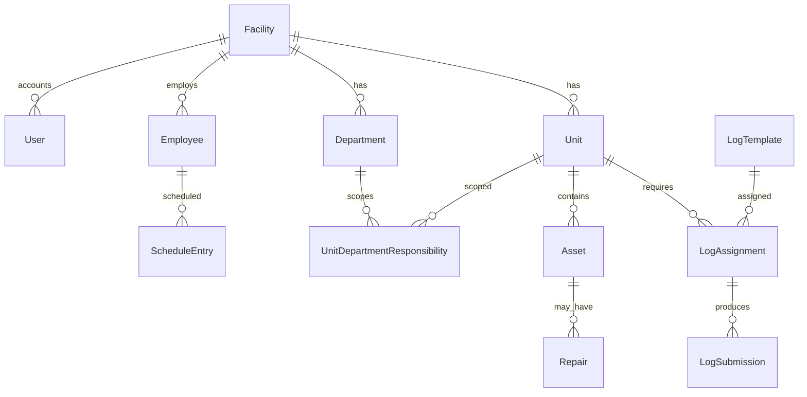

# 6. Domain Assessment

How business concepts are represented in the current codebase. This describes **what exists**, not what should exist.

---

## Facility

| Aspect | Representation |
|--------|----------------|
| Model | `Facility` |
| Scope | Tenancy root; one row per deployment typical |
| Fields | `displayName`, `managementCompanyName`, `billingEmail`, Stripe IDs, onboarding timestamps, `brandColor`, union handbook path |
| UI | Admin → Organization; appears in app shell header |
| Notes | Multi-site is anticipated in schema comments but not productized |

---

## Department

| Aspect | Representation |
|--------|----------------|
| Model | `Department` |
| Keys | Stable slug `key` per facility (e.g. dietary, evs, plant) |
| Relationships | Units via `UnitDepartmentResponsibility`; employees via primary + `EmployeeDepartment`; assets, repairs, logs, work shifts |
| Leadership | `headEmployeeId` — operational lead, distinct from app `RoleKey.GM` |
| Visibility | `showInEmployeeApp` controls HR picker visibility |
| UI | Admin → Departments; department settings page; department tabs on employees; department nav scoping |
| Default seed | DIETARY, EVS, PLANT via `ensureDefaultDepartments` |

---

## Location / Unit

| Aspect | Representation |
|--------|----------------|
| Model | `Unit` (there is no separate "Location" entity) |
| Types | `UnitType` enum: SERVERY, KITCHEN, RESIDENT_AREA, EVS_ZONE, MECHANICAL, etc. |
| Hierarchy | `parentUnitId` self-relation |
| Ordering | `displayOrder`, `isActive` |
| Meal config | `UnitMealTime` per `MealType` |
| Department link | `UnitDepartmentResponsibility` with kind (PRIMARY/BACKUP), risk/cleaning/inspection frequency strings |
| UI | Units builder; sidebar "Locations"; unit dashboards |
| Notes | Unit names are facility-specific, never hardcoded in code |

---

## Room / Area (EVS)

| Aspect | Representation |
|--------|----------------|
| Model | `RoomAreaStatus` |
| Scope | One status row per `unitId` + `statusDate` |
| Statuses | CLEAN, DIRTY, OCCUPIED, DISCHARGE, ISOLATION, TERMINAL_CLEAN_PENDING |
| Actor | `updatedByEmployeeId` optional |
| UI | EVS board — units linked to EVS department |
| Notes | EVS "rooms" are operational units, not a separate room inventory |

---

## Employee

| Aspect | Representation |
|--------|----------------|
| Model | `Employee` |
| Distinction from User | Employee = roster person (PIN, HR); User = email login account |
| Identity | `firstName`, `lastName`, `phone`, `email` optional |
| Permission tier | `roleType` (`RoleKey`) — operational role, not job title |
| Job title | `JobTitle` model (display only) |
| Classification | `JobClassification` enum (COOK, FOOD_SERVICE_WORKER, etc.) |
| Stations | `EmployeeWorkStation` M:N with `WorkStation` enum |
| Status | `EmployeeStatus`: ACTIVE, OFF, TERMINATED |
| Union / HR | `unionMember`, hire date, birthday month/day, shirt size, on leave, HR notes |
| CHRC | `chrcStatus`, cleared date, offboarding fields on termination |
| PIN | `pinDigest` — 6-digit, facility-unique |
| Unit focus | `primaryUnitId`, `EmployeeUnitAccess` list |
| Department | `primaryDepartmentId`, `EmployeeDepartment` for floaters |
| UI | `/employees` cards with Personal, HR, CHRC, Assignments, Discipline tabs |

---

## User (app account)

| Aspect | Representation |
|--------|----------------|
| Model | `User` |
| Auth | Email + `passwordHash` |
| Role | `roleId` → `Role` → `RoleKey` |
| Facility | `facilityId` required |
| Department | Optional `primaryDepartmentId` for scoped nav |
| UI | Login, signup, account password change |
| Notes | FA/GM users may also have matching `Employee` rows for PIN/roster parity |

---

## Role and permission

| Aspect | Representation |
|--------|----------------|
| App roles | `Role` + `RoleKey` enum (6 tiers) |
| Route permissions | `AppRoute` + `RoleRoutePermission` matrix |
| Operational vs app | `Employee.roleType` is floor tier; `User.role` is app access tier; `EmployeeDepartment.roleType` for floater context |
| UI | Admin → Permissions |
| Enforcement | `proxy.ts`, server actions, `requireAtLeastRole` |

---

## Schedule / shift / assignment

| Concept | Representation |
|---------|----------------|
| Standing assignment | `DefaultAssignment` — employee + unit + roleType |
| Planned shift | `ScheduleEntry` — date, `ShiftType`, unit, optional `WorkShift` |
| Day-of change | `AssignmentOverride` — old/new unit, reason, optional meal |
| Named shift blocks | `WorkShift` — local start/end strings per department |
| UI | `/staffing` grid, employee card assignments tab |
| Eligibility | `scheduling-eligibility.ts` filters by unit type |

---

## Checklist / log / inspection

| Concept | Representation |
|---------|----------------|
| Checklist definition | `LogTemplate` + `LogTemplateField` |
| Assignment to unit | `LogAssignment` with recurrence, meal type, required role |
| Completion record | `LogSubmission` + `LogSubmissionValue` |
| Status | COMPLETED, FAILED, MISSED |
| Field types | Temperature, pass/fail, yes/no, numbers, text, dropdown |
| Inspection-like work | Log templates serve as configurable inspections; EVS uses `RoomAreaStatus` separately |
| UI | `/logs` four tabs; unit dashboard quick entry |

---

## Task

| Concept | Representation |
|---------|----------------|
| Generic task | **Not modeled** |
| Closest equivalents | `LogSubmission` (compliance tasks), `Repair` (maintenance tasks), `AssignmentOverride` (staffing changes) |

---

## Menu / meal

| Concept | Representation |
|---------|----------------|
| Cycle config | `MenuSettings` — weeks, anchor date, week start day |
| Menu items | `MenuItem` grid: week, day, meal period, category, portions |
| Meal periods | Keys like breakfast/lunch/dinner in `mealPeriodKey` |
| Servery timing | `ServeryMealServiceEvent` — ready/started per unit per meal per day |
| Unit meal schedule | `UnitMealTime` |
| UI | `/menus` builder; unit dashboard today's menu |

---

## Equipment / asset

| Concept | Representation |
|---------|----------------|
| Model | `Asset` |
| Identity | `assetCode` (globally unique), name, `equipmentType` |
| Placement | `unitId`, optional `departmentId` |
| Vendor | Optional `vendorId` |
| Status | ACTIVE, OUT_OF_SERVICE, RETIRED |
| UI | `/assets` sub-tab |

---

## Vendor

| Concept | Representation |
|---------|----------------|
| Model | `Vendor` |
| Scope | Per facility, unique name |
| Links | Assets, repairs |
| UI | `/assets?subtab=vendors` |

---

## Work order / repair

| Concept | Representation |
|---------|----------------|
| Model | `Repair` |
| Kinds | CORRECTIVE (default), PREVENTIVE (linked to schedule) |
| Trade | EQUIPMENT, PLUMBING, ELECTRICAL, GENERAL |
| Routing | Requesting and responsible `Department` |
| Assignment | `assignedEmployeeId`, optional vendor |
| Lifecycle | OPEN → IN_PROGRESS → WAITING_PARTS → CLOSED |
| History | `RepairUpdate` rows |
| PM | `PreventiveMaintenanceSchedule` on assets |
| UI | `/repairs`, EVS quick ticket, dashboard cards |

---

## Discipline / union HR

| Concept | Representation |
|---------|----------------|
| Union flag | `Employee.unionMember` (single boolean) |
| Points | `DisciplinePointEntry` — attendance vs performance |
| Handbook | PDF on `Facility`, streamed via API |
| Separation | `EmployeeTerminationRecord` + `SeparationKind` |
| Audit | `EmployeeHrAuditLog` field snapshots |
| UI | Employee card discipline tab, points summary, separations, HR audit |

---

## Compliance (CHRC)

| Concept | Representation |
|---------|----------------|
| Status | `ChrcStatus` enum on employee |
| Offboarding | `chrcOffboardingCompletedAt` on termination |
| Report | `/employees/chrc-report` |
| Notes | Tracks NYS LTC background check process; does not integrate with government systems |

---

## Billing / customer

| Concept | Representation |
|---------|----------------|
| Stripe customer | `Facility.stripeCustomerId` |
| Payment method | `stripeDefaultPaymentMethodId` |
| Onboarding | Card capture during `/setup` |
| Subscription plans | Not modeled |

---

## Device / kiosk

| Concept | Representation |
|---------|----------------|
| Facility binding | Cookie `ltc_device_facility` |
| Unit lock | Cookie `ltc_device_unit` |
| Audit | `KioskUnitPinLoginEvent` |
| UI | Bind device form on organization settings; PIN gate on login |

---

## Attachment / document

| Concept | Representation |
|---------|----------------|
| Log/repair files | `Attachment` model |
| Union handbook | Path fields on `Facility` |
| Storage | Local `uploads/facilities/{id}/` |

---

## Concepts explicitly absent

| Business concept | Status in codebase |
|------------------|-------------------|
| Resident / patient | Not represented |
| Inventory / PAR levels | Not represented |
| Messaging / announcements | Not represented |
| Clinical documentation | Not represented |
| Payroll / benefits | Not represented |
| Multi-facility district | Not represented |
| Contract / SLA between operator and facility | Not represented beyond management company name |

---

## Domain model diagram (simplified)

The **unit** is the central operational anchor; **department** is the organizational and routing dimension; **facility** is the tenancy boundary.
