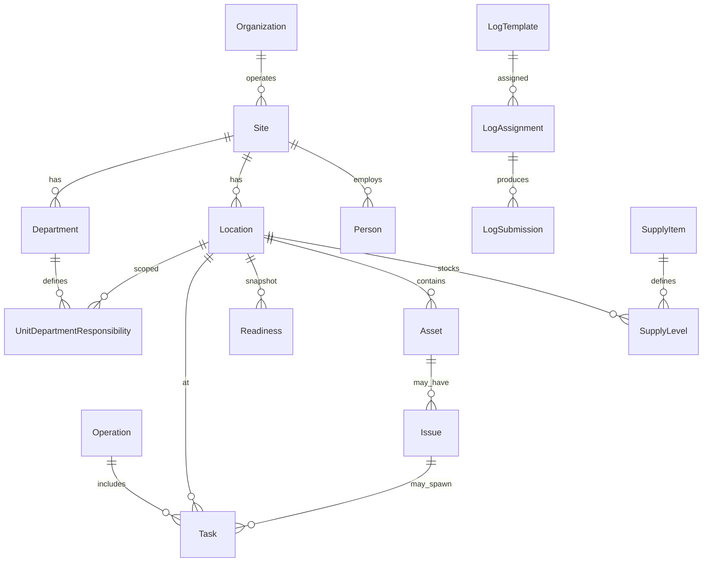

# Domain Model Target

**Status:** Planning document — **conceptual only, no migrations**  
**Date:** 2026-07-07  
**Principles:** [PRODUCT_CONSTITUTION.md](./PRODUCT_CONSTITUTION.md)  
**Current mapping:** [CURRENT_STATE_VS_TARGET_STATE.md](./CURRENT_STATE_VS_TARGET_STATE.md)

This document drafts the **target domain model** for a multi-vertical operations platform. Implementation today lives in `ltc-manager/prisma/schema.prisma`; this is the **north star**, not the schema.

---

## Design goals

1. **One platform** serves long-term care, hospitals, K-12, universities, corporate dining, EVS, and plant operations.
2. **Industry packs** add terminology, default departments, log presets, and compliance fields — not separate codebases.
3. **Location-centric execution** — work happens at a place on a schedule.
4. **Operations before documentation** — logs and tasks attach to operational moments.
5. **Organization → Site → Location** hierarchy supports contract operators and districts.

---

## Core hierarchy

```
Organization          (operating company, school district, health system)
└── Site              (facility, campus, hospital, school building)     [≈ Facility today]
    ├── Department    (food service, EVS, plant, housekeeping, …)
    ├── Location      (servery, dining hall, zone, kitchen, closet)     [≈ Unit today]
    │   └── (optional parent Location for hierarchy)
    ├── Person        (roster member)
    ├── UserAccount   (email login; may link to Person)
    └── OperationalMode configuration (which modules active)
```

**Tenancy (phased):**

- **Phase A (current):** Site is tenancy root (`facilityId`).
- **Phase B (target):** Organization is billing and policy root; Site is operational scope; session carries `siteId` (+ optional `organizationId` for rollup users).

---

## Entity catalog

### Organization

| Attribute | Description |
|-----------|-------------|
| Purpose | Contract dining company, university dining services, hospital system, K-12 district |
| Owns | Many sites; optional shared template library, supply catalogs, branding |
| Not | A single building — that is Site |

**Vertical examples:**

| Vertical | Organization example |
|----------|---------------------|
| LTC | Regional food service management company |
| Hospital | Health system facilities services |
| K-12 | County school district |
| University | Campus dining services (single org, many sites) |
| Corporate | Enterprise workplace services vendor |

---

### Site

| Attribute | Description |
|-----------|-------------|
| Purpose | One deployable operational campus or building |
| Maps from | `Facility` |
| Configures | Time zone, brand, departments, locations, billing hook |
| Isolation | Operational data scoped to site unless org rollup |

**Industry-neutral label in UI:** Site (display name configurable: "Terrace View," "North Campus Dining," "Building 3").

---

### Department

| Attribute | Description |
|-----------|-------------|
| Purpose | Operational lane with own roster slice, routing rules, and nav |
| Examples | Food Service, EVS, Plant, Housekeeping, Retail |
| Relations | Locations (responsibility), people (membership), assets, issues, log templates |
| Lead | Department head (operational, not IT admin) |

**Industry pack defaults:**

| Pack | Typical departments |
|------|---------------------|
| LTC / Hospital | Dietary, EVS, Plant Operations |
| K-12 / University | Food Service, Custodial, Facilities |
| Corporate dining | Culinary, Catering, Facilities |
| EVS-only module | Environmental Services, Linen (optional) |

---

### Location

| Attribute | Description |
|-----------|-------------|
| Purpose | Where work is executed — the operational anchor |
| Maps from | `Unit` |
| Types | Extensible: servery, kitchen, dining hall, EVS zone, mechanical room, restroom cluster, classroom wing, loading dock |
| Hierarchy | Optional parent location (floor → wing → room group) |
| Config | Meal times (food service), department responsibilities, display order |

**Principle:** Sidebar navigation and unit dashboards remain location-driven.

---

### Person and UserAccount

| Concept | Description |
|---------|-------------|
| **Person** | Someone on the roster — may work at site with PIN, stations, departments |
| **UserAccount** | Email/password identity for managers and admins |
| Link | Optional 1:1 or 1:many (district admin ≠ roster) |
| Auth | PIN (floor), email (office); future SSO on UserAccount |

Maps from: `Employee` (Person), `User` (UserAccount).

---

### OperationalMode

| Attribute | Description |
|-----------|-------------|
| Purpose | Selects which module bundle and nav the site uses |
| Examples | `DIETARY`, `EVS`, `PLANT`, `HOUSEKEEPING`, `FULL_FACILITY` |
| Behavior | Filters top nav, dashboard widgets, default log packs |
| Maps from | Department cookie + route permissions (today) |

**Target:** Configuration row per site, not hardcoded `department-nav.ts` keys.

---

### Operation (OperationInstance)

| Attribute | Description |
|-----------|-------------|
| Purpose | A bounded slice of time when a set of work must happen |
| Examples | "Breakfast 2026-07-07," "Lunch service Building A," "EVS day shift round 2" |
| Attributes | Site, date, window (start/end), meal period or shift label, operational mode |
| Links | Staffing expectations, logs due, readiness snapshot, open issues |

**Maps from (building blocks today):** `MealType` + date, `ServeryMealServiceEvent`, `WorkShift`, schedule date — not yet one entity.

**Why it matters:** Dashboard "how is breakfast going?" is an operation query, not 5 separate queries.

---

### Task

| Attribute | Description |
|-----------|-------------|
| Purpose | Episodic work: assignable, completable, auditable |
| Subtypes | `COMPLIANCE_LOG`, `AD_HOC`, `CALL_DOWN`, `ISSUE_FOLLOW_UP`, `SUPPLY_ACTION` |
| State | Open, in progress, completed, cancelled, missed |
| Context | Site, location, operation (optional), assignee, due at |
| Knowledge | Instructions, attachments, comments thread |

**Maps from today:**

| Today | Task relationship |
|-------|-------------------|
| `LogSubmission` | Compliance log task (specialized) |
| `Repair` | Issue follow-up task |
| `AssignmentOverride` | Staffing / call-down-like (partial) |

**Constitution fit:** Call-downs and "cover 4A" are tasks, not spreadsheet rows.

---

### Log (ComplianceLog)

| Attribute | Description |
|-----------|-------------|
| Purpose | Regulated or policy-driven checklist captured at a location |
| Structure | Template → fields → assignment (recurrence) → submission |
| Maps from | `LogTemplate`, `LogAssignment`, `LogSubmission` — **preserve** |
| Specialization | Task subtype where completion produces audit record |

**Vertical examples:**

| Vertical | Log examples |
|----------|--------------|
| LTC / Hospital | Temp logs, sanitizer, FIFO, meal count |
| K-12 | HACCP line checks, milk temperature |
| University | Retail grab-n-go temps |
| EVS | Room status rounds (may also use Readiness) |

---

### Readiness

| Attribute | Description |
|-----------|-------------|
| Purpose | Is this location ready for the current operation? |
| Signals | Logs complete, servery meal started, staffing covered, open blocking issues, supply PAR met |
| Maps from | Composite today: `ServeryMealServiceEvent`, log completion %, `RoomAreaStatus`, staffing grid |
| UI | Unit board + dashboard card — green/yellow/red |

Not a single table today — **target aggregate** (computed or materialized).

---

### Asset

| Attribute | Description |
|-----------|-------------|
| Purpose | Equipment installed at a location |
| Attributes | Code, name, type, status, vendor, owning department |
| Maps from | `Asset`, `Vendor`, `PreventiveMaintenanceSchedule` |

---

### SupplyItem

| Attribute | Description |
|-----------|-------------|
| Purpose | Consumable or replenish-able item used in operations |
| Examples | Tray covers, chemicals, disposables, smallwares |
| Relations | PAR level per location or site store; depletion events |
| Triggers | Shortage → Issue or CallDown task |

**Not in current schema** — missing foundation.

---

### Issue

| Attribute | Description |
|-----------|-------------|
| Purpose | Anything wrong that needs resolution |
| Types | Equipment, plumbing, electrical, supply shortage, safety, housekeeping, general |
| Lifecycle | Open → in progress → waiting (parts/info) → closed |
| Context | Location, asset (optional), requesting department, responsible department |
| Maps from | `Repair` — rename/generalize later |

---

### Staffing

| Concept | Description |
|---------|-------------|
| **DefaultAssignment** | Standing "usually here" |
| **ScheduleEntry** | Planned shift at location |
| **AssignmentOverride** | Day-of change |
| **CallDown** | Target: Task requesting coverage with acknowledgment |

Maps from existing staffing models; call-down is new.

---

### Attachment and Knowledge

| Concept | Description |
|---------|-------------|
| **Attachment** | File on submission, issue, task, separation record |
| **PolicyDocument** | Union handbook, SOP PDF — site or org level |
| Principle | Knowledge attached to work moment (constitution §5) |

Maps from: `Attachment`, facility handbook path.

---

## Vertical applicability matrix

| Entity | LTC | Hospital | K-12 | University | Corporate | EVS | Plant |
|--------|-----|----------|------|------------|-----------|-----|-------|
| Organization | ✓ | ✓ | ✓ | ✓ | ✓ | ✓ | ✓ |
| Site | ✓ | ✓ | ✓ | ✓ | ✓ | ✓ | ✓ |
| Department | ✓ | ✓ | ✓ | ✓ | ✓ | ✓ (primary) | ✓ (primary) |
| Location | ✓ | ✓ | ✓ | ✓ | ✓ | ✓ | ✓ |
| Operation | ✓ | ✓ | ✓ | ✓ | ✓ | ✓ | ✓ |
| Task / Log | ✓ | ✓ | ✓ | ✓ | ✓ | ✓ | ✓ |
| Readiness | ✓ | ✓ | ✓ | ✓ | ✓ | ✓ | ✓ |
| Asset / Issue | ✓ | ✓ | ✓ | ✓ | ✓ | ✓ | ✓ (primary) |
| SupplyItem | ✓ | ✓ | ✓ | ✓ | ✓ | ✓ | ✓ |
| Person / PIN | ✓ | ✓ | ✓ | ✓ | ✓ | ✓ | ✓ |

---

## Industry packs (configuration, not code forks)

An **IndustryPack** bundles:

- Default department keys and display names
- Default location types
- Log template presets
- Optional HR field sets (e.g. CHRC for NYS LTC — **not** in core)
- Dashboard widget set for operational mode
- Terminology map (`Site` vs `Facility`, `Resident area` vs `Patient unit` vs `Classroom wing`)

**Rule:** Core enums stay minimal; packs add labeled extensions or metadata.

---

## Relationship diagram (target)



---

## Mapping: current → target (implementation guide)

| Target | Current model | Action |
|--------|---------------|--------|
| Site | `Facility` | Preserve; rename in UI gradually |
| Organization | `managementCompanyName` | Missing foundation |
| Location | `Unit` | Preserve |
| Department | `Department` | Preserve; decouple nav from code keys |
| Person | `Employee` | Preserve |
| UserAccount | `User` | Preserve |
| ComplianceLog | `LogTemplate` / `Submission` | Preserve |
| Issue | `Repair` | Refactor later |
| Asset | `Asset` | Preserve |
| SupplyItem | — | Missing foundation |
| Task | — | Missing foundation |
| Operation | (implicit) | Missing foundation |
| Readiness | (computed) | Missing foundation |
| CallDown | `AssignmentOverride` (partial) | Missing foundation |

---

## Out of scope for domain model

- Residents, patients, students as entities
- Clinical documentation, grades, HR payroll
- Full ERP inventory and purchasing
- EMR / SIS integration (future integration points only)

---

## References

- [ARCHITECTURE_DECISION_LOG.md](./ARCHITECTURE_DECISION_LOG.md)
- [CURRENT_STATE_VS_TARGET_STATE.md](./CURRENT_STATE_VS_TARGET_STATE.md)
- [FIRST_PRODUCT_SLICE.md](./FIRST_PRODUCT_SLICE.md)
