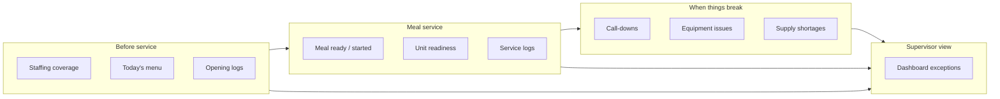

# First Product Slice: Dietary Operational Mode

> **Retired (2026-09-25):** Industry packs as the path to new verticals are retired. See [RETIRED.md](./RETIRED.md).

**Status:** Planning document — **no implementation authorized here**  
**Date:** 2026-07-07  
**Principles:** [PRODUCT_CONSTITUTION.md](./PRODUCT_CONSTITUTION.md)  
**Decisions:** [ARCHITECTURE_DECISION_LOG.md](./ARCHITECTURE_DECISION_LOG.md)

Defines the **first practical product slice** on the existing LTC Manager repo: a cohesive **Dietary Operational Mode** that packages what exists, names the operational story, and specifies thin additions for gaps.

---

## Slice intent

**Give dietary managers and supervisors one place to run today's meal service** — from "are we staffed?" to "are serveries ready?" to "what failed?" — without leaving the platform or opening spreadsheets.

This slice **does not** require a new app or rewrite. It **does** require product packaging, dashboard prioritization, and targeted foundation for call-downs and supplies.

---

## Primary users

| Persona | Role (today) | Slice needs |
|---------|--------------|-------------|
| Shift supervisor | SUPERVISOR+ | Unit readiness, staffing gaps, open issues, log failures |
| Department manager | MANAGER+ | Coverage across locations, call-downs, reports for today |
| Floor staff | STAFF (PIN) | Submit logs, mark meal ready/started, report equipment/supply problems |
| Facility admin | FA / GM | Configure units, templates, roster (existing admin flows) |

---

## Operational story (one day)

---

## Slice capabilities

### 1. Today's meal service rhythm

**What it means:** Supervisors and staff see **which meal period is active** and what has happened for each location today.

| Capability | Current state | Slice treatment |
|--------------|---------------|-----------------|
| Meal period selection (B/L/D) | **Production-ready** — `ServeryMealServiceControls`, daypart auto-select | **Preserve** — center on unit dashboard |
| Meal ready / started timestamps | **Production-ready** — `ServeryMealServiceEvent` | **Preserve** |
| Scheduled meal times per unit | **Production-ready** — `UnitMealTime` | **Preserve** — show on unit board |
| Today's menu at unit | **Production-ready** — menu cycle + unit dashboard | **Preserve** |
| Operation entity | Missing | **Defer** — compose from meal type + date in UI |

**Slice deliverable (conceptual):** A **"Today" dietary header** on global dashboard and unit dashboard: current meal period, countdown to scheduled service times, ready/started status per servery.

---

### 2. Staffing coverage

**What it means:** Managers see **who should be at each location today** and where plan diverges from reality.

| Capability | Current state | Slice treatment |
|--------------|---------------|-----------------|
| Schedule grid by unit/date | **Production-ready** — `/staffing` | **Preserve** |
| Default assignments | **Production-ready** | **Preserve** |
| Day-of overrides | **Production-ready** — `AssignmentOverride` | **Preserve** — treat as proto call-down |
| Auto-assign helper | **Partial** | **Preserve** as-is |
| Coverage signal on dashboard | **Production-ready** — staffing section on dashboard | **Enhance priority** in dietary mode |
| Real-time call-down workflow | Missing | **Missing foundation** — see §8 |

**Slice deliverable:** Dashboard **staffing exception card**: units with zero scheduled staff for current meal period, or override unresolved.

---

### 3. Unit readiness

**What it means:** Per location, **is this servery/kitchen ready to serve** the current meal?

| Signal | Current source | Slice treatment |
|--------|----------------|-----------------|
| Opening/service logs complete | `LogSubmission` vs `LogAssignment` | **Preserve** |
| Meal ready/started | `ServeryMealServiceEvent` | **Preserve** |
| Open equipment issues at unit | `Repair` open at `unitId` | **Preserve** |
| Staff assigned | `ScheduleEntry` | **Preserve** |
| Unified readiness score | Missing | **Missing foundation** — computed **Readiness** aggregate (no migration required for v0: server-side composite) |

**Slice deliverable:** **Readiness chip** per unit on dashboard: Complete / In progress / Blocked (failed log, open critical issue, or not staffed).

**Blocked definition (slice v0):**

- Required log for current meal/day marked FAILED, or
- OPEN repair with HIGH/URGENT at unit, or
- No schedule entry for current shift at SERVERY/KITCHEN unit (configurable)

---

### 4. Logs

**What it means:** Compliance capture **at the unit during service** — temps, sanitizer, pass/fail.

| Capability | Current state | Slice treatment |
|--------------|---------------|-----------------|
| Template builder + assignments | **Production-ready** | **Preserve** |
| Submit + history | **Production-ready** | **Preserve** |
| Meal-linked assignments | **Production-ready** | **Preserve** |
| Unit dashboard quick entry | **Production-ready** | **Preserve** — primary floor path |
| Failed temp visibility | **Production-ready** — reports + dashboard | **Preserve** — surface on dietary dashboard |
| Missed log automation | **Partial** | **Refactor later** — background job |
| Attachments | **Partial** | **Refactor later** |

**Slice deliverable:** Dietary dashboard section **"Logs due now"** filtered to current meal period and dietary department templates.

---

### 5. Call-downs

**What it means:** When someone calls off or a unit is short, supervisors **request coverage** and track response — resilience principle.

| Capability | Current state | Slice treatment |
|--------------|---------------|-----------------|
| Schedule override with reason | **Production-ready** | **Preserve** — manual call-down |
| Request/ack workflow | Missing | **Missing foundation** |
| Notifications | Missing | **Missing foundation** |
| Task entity | Missing | **Thin v0:** optional `CallDown` or `Task` type without full task platform |

**Slice minimum (conceptual):**

- Manager creates **coverage request**: location, meal period, reason, optional role needed.
- Status: Open → Covered (linked override or schedule edit) → Closed.
- Visible on dashboard **Call-downs open** card.
- Floor: no push in v0 — supervisor-driven.

**Interim without new tables:** Promote **AssignmentOverride** creation from dashboard with "call-down" reason template and open override list — labeled Call-downs in UI.

---

### 6. Equipment issues

**What it means:** Something broken affects service — hot box down, dishwasher, warmer.

| Capability | Current state | Slice treatment |
|--------------|---------------|-----------------|
| Create repair / work order | **Production-ready** — `/repairs` | **Preserve** |
| Priority + status | **Production-ready** | **Preserve** |
| Unit dashboard visibility | **Partial** — global dashboard | **Slice:** show open issues on unit readiness |
| Quick create from unit | **Production-ready** — EVS pattern exists | **Extend** quick issue form on unit dashboard (dietary) |
| PM schedules | **Partial** | **Out of slice** unless blocking |

**Slice deliverable:** **Report issue** on unit dashboard (title, priority, unit pre-filled); dietary dashboard **open equipment issues** list.

---

### 7. Supplies / items

**What it means:** Running out of trays, chemicals, or disposables **during service** — captured and visible.

| Capability | Current state | Slice treatment |
|--------------|---------------|-----------------|
| Supply catalog | Missing | **Missing foundation** |
| PAR levels | Missing | **Defer full PAR** |
| Shortage report | Missing | **Slice minimum** |

**Slice minimum (conceptual):**

- Small **supply short report** form: item name (free text or quick picks), location, severity, note.
- Creates **Issue** type SUPPLY_SHORT (via extended repair or thin new type) — routed to dietary manager.
- Dashboard card: **supply shorts today**.

**Full SupplyItem model:** post-slice ([DOMAIN_MODEL_TARGET.md](./DOMAIN_MODEL_TARGET.md)).

---

### 8. Manager and supervisor visibility

**What it means:** One **Dietary Operational dashboard** — exceptions first, drill-down second.

| Surface | Current state | Slice treatment |
|---------|---------------|-----------------|
| Global dashboard | **Production-ready** — multiple cards | **Repackage** as Dietary Mode home |
| Reports | **Production-ready** — date range | **Preserve** — link for historical |
| Real-time exception priority | Partial | **Define default card order** |

**Proposed default card order (Dietary Mode):**

1. **Current meal period** banner (site-wide)
2. **Call-downs open** (or overrides needing coverage)
3. **Units not ready** (readiness blocked)
4. **Logs failed or overdue**
5. **Open equipment / supply issues**
6. **Staffing gaps** (current period)
7. Servery meal status grid (existing)
8. Birthdays / secondary (existing, lower)

**Supervisor drill-down:** Unit dashboard → logs, servery controls, issue form.

**Manager drill-down:** Staffing grid, repairs list, reports.

---

## Mode packaging (UX, not new schema)

**Dietary Operational Mode** = when user's active department is **Food Service / Dietary** (or FA with dietary context):

- Top nav emphasizes: Dashboard, Locations, Logs, Staffing, Menus, Repairs (Assets supervisor+).
- Dashboard uses card order above.
- EVS/Plant modules hidden unless user switches mode (existing department switcher).

**Maps from:** `ltc_active_department` + `department-nav.ts` — **refactor later** to `OperationalMode` config.

---

## In scope vs out of scope

| In scope | Out of scope (this slice) |
|----------|---------------------------|
| Today's meal rhythm UX | Full Operation entity |
| Readiness composite (computed) | Organization multi-site |
| Call-down v0 (override-based or thin task) | Push notifications |
| Supply short reporting (minimal) | Full inventory/PAR |
| Unit issue quick form | Issue → Repair rename migration |
| Dietary dashboard repackaging | K-12 / hospital industry packs |
| PIN floor flows for logs + servery | SSO |
| Manager/supervisor exception cards | Advanced analytics / exports |

---

## Success criteria (slice)

A supervisor can answer in **under 60 seconds** without leaving the app:

1. Which serveries are **not ready** for the current meal?
2. Where am I **short staff**?
3. What **logs failed** or are still due?
4. What **equipment or supply** problems are open?
5. Is there an **uncovered call-down**?

A floor employee on a unit tablet can:

1. Mark meal **ready/started**.
2. Complete **assigned logs**.
3. **Report equipment or supply** problem in &lt; 30 seconds.

---

## Implementation phases (planning only)

| Phase | Focus | Builds on |
|-------|-------|-----------|
| **S0** | Name and nav: Dietary Mode dashboard card order, copy | Existing dashboard |
| **S1** | Readiness composite (server-side), unit chips | Logs, servery, repairs, staffing |
| **S2** | Call-down v0 (override list + create from dashboard) | AssignmentOverride |
| **S3** | Unit quick issue + supply short form | Repair actions |
| **S4** | Supply catalog foundation (optional) | New schema — separate proposal |

No phase authorized by this document alone.

---

## Dependency on existing modules

| Module | Route | Role in slice |
|--------|-------|---------------|
| Dashboard | `/dashboard` | Primary supervisor surface |
| Unit dashboard | `/unit/[unitId]` | Primary floor surface |
| Staffing | `/staffing` | Coverage |
| Logs | `/logs` | Compliance |
| Menus | `/menus` | Production context |
| Repairs | `/repairs` | Equipment issues |
| Employees | `/employees` | Roster (background) |
| Units | `/units` | Configuration |

---

## References

- [04-existing-features.md](../architecture-review/04-existing-features.md)
- [CURRENT_STATE_VS_TARGET_STATE.md](./CURRENT_STATE_VS_TARGET_STATE.md)
- [DOMAIN_MODEL_TARGET.md](./DOMAIN_MODEL_TARGET.md)
- [PRODUCT_CONSTITUTION.md](./PRODUCT_CONSTITUTION.md)
